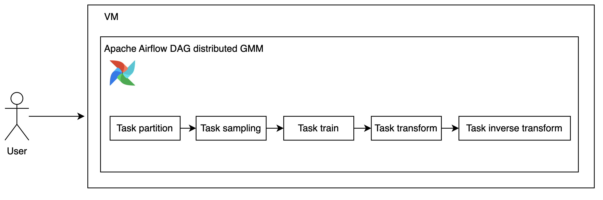

# distributed-GMM

Distributed GMM to scale to any size of data. **Currently only support continuous column**.

## how to

Before that, make sure meet all requirements,

```bash
pip3 install -r requirements.txt
```

### Simulating huge data

#### Generate randomly

```bash
python3 distributed_gmm/generate_random.py --help
```

```
Usage: generate_random.py [OPTIONS]

Options:
  --row_size INTEGER        number of rows to generate
  --partition_size INTEGER  size of partition
  --batch_size INTEGER      batch size to send to dask to prevent big graph
                            warning
  --save_directory TEXT     save directory
  --help                    Show this message and exit.
```

Generate 100k rows and partition each 5k rows,

```bash
python3 distributed_gmm/generate_random.py --row_size 100000 --partition_size 5000 --save_directory './save'
```

```
running local cluster LocalCluster(ecac55d0, 'tcp://127.0.0.1:43199', workers=5, threads=20, memory=78.33 GiB)
100%|████████████████████████████████████████████████████████████████████████████████████████| 1/1 [00:00<00:00,  8.13it/s]
done! Time taken 0.11078763008117676 seconds
```

Took 0.11078763008117676 seconds to generate random 100k rows.

**If the model is very memory consuming like O^2, it is better to make sure the partition size is small because each partitions will train the model, this can explode the memory pretty quickly**.

### Fit GMM incrementally

```bash
python3 distributed_gmm/fit.py --help
```

```
Usage: fit.py [OPTIONS]

Options:
  --partition_directory TEXT  partition directory
  --num_clusters INTEGER      number of cluster
  --save_file TEXT            model save name
  --help                      Show this message and exit.
```

```bash
python3 distributed_gmm/fit.py
```

```
 99%|████████████████████████████████████████████████████████████████████████████████████▏| 99/100 [01:13<00:00,  1.05it/s]/home/husein/.local/lib/python3.10/site-packages/sklearn/mixture/_base.py:268: ConvergenceWarning: Initialization 1 did not converge. Try different init parameters, or increase max_iter, tol or check for degenerate data.
  warnings.warn(
100%|████████████████████████████████████████████████████████████████████████████████████| 100/100 [01:14<00:00,  1.35it/s]
done! Time taken 74.2618260383606 seconds
```

Took 74.2618260383606 seconds to incrementally train 100k rows.

### Transform distributedly

```bash
python3 distributed_gmm/transform.py --help
```

```
Usage: transform.py [OPTIONS]

Options:
  --partition_directory TEXT  partition directory
  --model_filename TEXT       model filename
  --save_directory TEXT       transform directory to save
  --eps FLOAT                 epsilon
  --help                      Show this message and exit.
```

```bash
python3 distributed_gmm/transform.py
```

```
/home/husein/.local/lib/python3.10/site-packages/sklearn/base.py:493: UserWarning: X does not have valid feature names, but BayesianGaussianMixture was fitted with feature names
  warnings.warn(
/home/husein/.local/lib/python3.10/site-packages/sklearn/base.py:493: UserWarning: X does not have valid feature names, but BayesianGaussianMixture was fitted with feature names
  warnings.warn(
/home/husein/.local/lib/python3.10/site-packages/sklearn/base.py:493: UserWarning: X does not have valid feature names, but BayesianGaussianMixture was fitted with feature names
  warnings.warn(
/home/husein/.local/lib/python3.10/site-packages/sklearn/base.py:493: UserWarning: X does not have valid feature names, but BayesianGaussianMixture was fitted with feature names
  warnings.warn(
done! Time taken 2.5795013904571533 seconds
```

Took 2.5795013904571533 seconds to distributedly transformed 100k rows.

### Inverse transform distributedly

```
python3 distributed_gmm/inverse_transform.py --help
```

```
Usage: inverse_transform.py [OPTIONS]

Options:
  --partition_directory TEXT  partition directory
  --model_filename TEXT       model filename
  --transform_directory TEXT  transform directory to save
  --help                      Show this message and exit.
```

```
python3 distributed_gmm/inverse_transform.py
```

```
partition id 16, MSE 16.40408912192847
partition id 13, MSE 10.011880046104814
partition id 12, MSE 16.24049570475697
done! Time taken 0.14910507202148438 seconds
```

Took 0.14910507202148438 seconds to distributedly inverse transformed 100k rows.

## Estimate time taken for 1B rows

Using default 5 workers 20 threads,

```
running local cluster LocalCluster(0ab1dbbf, 'tcp://127.0.0.1:41463', workers=5, threads=20, memory=78.33 GiB)
```

**If you check the code, `before` variable put literally behind few lines from the actual compute, this is to make sure we compute the actual time taken just for the execution**.

### Generate random rows

(0.11078763008117676 / 1e5) * 1e9 = 1107.8763008117676

1107.8763008117676 seconds or 18.46460501352946 minutes.

#### But actual execution might be more faster

```
python3 distributed_gmm/generate_random.py --row_size 1000000000 --partition_size 5000 --save_directory './save'
```

```
running local cluster LocalCluster(d8d462d2, 'tcp://127.0.0.1:39569', workers=5, threads=20, memory=78.33 GiB)
  1%|▉                                                                                   | 21/2000 [00:02<03:28,  9.51it/s]
```

Estimate from `tqdm` only 3 minutes!

### Fit GMM

(74.2618260383606 / 1e5) * 1e9 = 742618.260383606

742618.260383606 seconds or 12376.971006393433 minutes or 206.28285010655722 hours.

### Transform

(2.5795013904571533 / 1e5) * 1e9 = 25795.013904571533

25795.013904571533 seconds or 429.9168984095256 minutes or 7 hours.

**This actually might be more faster like generating the random rows**.

### Inverse Transform

(0.14910507202148438 / 1e5) * 1e9 = 1491.0507202148438

1491.0507202148438 seconds or 24.850845336914062 minutes.

**This actually might be more faster like generating the random rows**.

### Total

1107.8763008117676 + 742618.260383606 + 25795.013904571533 + 1491.0507202148438 = 771012.2013092041

771012.2013092041 seconds or 12850.203355153402 minutes or 214.17005591922336 hours.

## how to deploy on premise with zero internet?



### Why Airflow?

1. Everything run as DAG and separate.

If we put everything as one script, failure at certain points must rerun the entire script.

But if we run as DAG and each node run one function, failure at certain nodes, we just simply rerun that nodes.

2. Better logging system.

Each DAG nodes have their own logging files, easier for debugging.

3. RBAC UI.

Airflow UI natively RBAC, for an example, we want all users able to check the logs but not all able to rerun the DAG.

### Installation

1. Make sure already provided VM with necessary Linux OS, Redhat or Debian, both are fine, bring a base image with already installed necessary Python version,

For debian,

```bash
sudo apt update
sudo add-apt-repository ppa:deadsnakes/ppa -y
sudo apt update
sudo apt install python3.10 python3.10-dev -y
wget https://bootstrap.pypa.io/get-pip.py
python3 get-pip.py
python3 -m pip install --upgrade pip
```

2. Fetch all necessary wheels based on the requirements.txt,

Either this one you want to bundle together with the base image or you want to separate install, it depends on certain on-premise, some on-premises want to scan the whl files first and make sure everything able to install with 0 internet,

```bash
mkdir whl_dir
FILE="requirements.txt"
while IFS= read -r line || [[ -n "$line" ]]; do
    echo "Downloading: $line"
    pip3 download "$line"
done < "$FILE"
mv *.whl whl_dir
zip -r whl_dir.zip whl_dir
```