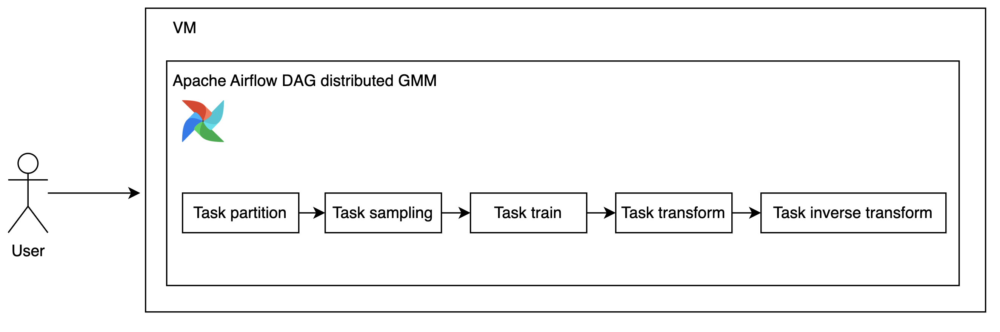

# distributed-GMM

Distributed GMM to scale to any size of data. **Currently only support continuous column**.

## how to

Before that, make sure meet all requirements,

```bash
pip3 install -r requirements.txt
```

### Simulating huge data

#### Generate randomly

```bash
python3 distributed_gmm/generate_random.py --help
```

```
Usage: generate_random.py [OPTIONS]

Options:
  --row_size INTEGER        number of rows to generate
  --partition_size INTEGER  size of partition
  --batch_size INTEGER      batch size to send to dask to prevent big graph
                            warning
  --save_directory TEXT     save directory
  --help                    Show this message and exit.
```

Generate 100k rows and partition each 5k rows,

```bash
python3 distributed_gmm/generate_random.py --row_size 100000 --partition_size 5000 --save_directory './save'
```

```
running local cluster LocalCluster(ecac55d0, 'tcp://127.0.0.1:43199', workers=5, threads=20, memory=78.33 GiB)
100%|████████████████████████████████████████████████████████████████████████████████████████| 1/1 [00:00<00:00,  8.13it/s]
done! Time taken 0.11078763008117676 seconds
```

Took 0.11078763008117676 seconds to generate random 100k rows.

**If the model is very memory consuming like O^2, it is better to make sure the partition size is small because each partitions will train the model, this can explode the memory pretty quickly**.

### Sampling distributedly

This is to reduce the amount of data to train the model by simply generate samples using `np.percentile` from 0-100 for each partitions,

```bash
python3 distributed_gmm/sampling.py --help
```

```
Usage: sampling.py [OPTIONS]

Options:
  --partition_directory TEXT      partition directory
  --max_sample_size_partition INTEGER
                                  max sample row size for each partition, it
                                  can be less but not more than definition
  --max_sample_size INTEGER       max sample size after merging from all
                                  partition samples, will perform another
                                  samples
  --save_directory TEXT           transform directory to save
  --save_file TEXT                save sampled file as npy format
  --help                          Show this message and exit.
```

```bash
python3 distributed_gmm/sampling.py
```

```
running local cluster LocalCluster(9e3703a8, 'tcp://127.0.0.1:34817', workers=5, threads=20, memory=78.33 GiB)
combined resample from partition (100000,)
final resample (10000,)
done! Time taken 0.14350247383117676 seconds
```

Took 0.14350247383117676 seconds to resample data from 100k rows to 10k rows.

### Fit GMM from the sampled data

```bash
python3 distributed_gmm/fit.py --help
```

```
Usage: fit.py [OPTIONS]

Options:
  --array_file TEXT       sampled npy file
  --num_clusters INTEGER  number of cluster
  --save_file TEXT        model save name
  --help                  Show this message and exit.
```

```bash
python3 distributed_gmm/fit.py
```

```
training data shape (10000, 1)
/home/husein/.local/lib/python3.10/site-packages/sklearn/mixture/_base.py:268: ConvergenceWarning: Initialization 1 did not converge. Try different init parameters, or increase max_iter, tol or check for degenerate data.
  warnings.warn(
done! Time taken 0.43245673179626465 seconds
```

Took 0.43245673179626465 seconds to train on 10k sampled rows.

### Transform distributedly

```bash
python3 distributed_gmm/transform.py --help
```

```
Usage: transform.py [OPTIONS]

Options:
  --partition_directory TEXT  partition directory
  --model_filename TEXT       model filename
  --save_directory TEXT       transform directory to save
  --eps FLOAT                 epsilon
  --help                      Show this message and exit.
```

```bash
python3 distributed_gmm/transform.py
```

```
/home/husein/.local/lib/python3.10/site-packages/sklearn/base.py:493: UserWarning: X does not have valid feature names, but BayesianGaussianMixture was fitted with feature names
  warnings.warn(
/home/husein/.local/lib/python3.10/site-packages/sklearn/base.py:493: UserWarning: X does not have valid feature names, but BayesianGaussianMixture was fitted with feature names
  warnings.warn(
/home/husein/.local/lib/python3.10/site-packages/sklearn/base.py:493: UserWarning: X does not have valid feature names, but BayesianGaussianMixture was fitted with feature names
  warnings.warn(
/home/husein/.local/lib/python3.10/site-packages/sklearn/base.py:493: UserWarning: X does not have valid feature names, but BayesianGaussianMixture was fitted with feature names
  warnings.warn(
done! Time taken 2.5795013904571533 seconds
```

Took 2.5795013904571533 seconds to distributedly transformed 100k rows.

### Inverse transform distributedly

```
python3 distributed_gmm/inverse_transform.py --help
```

```
Usage: inverse_transform.py [OPTIONS]

Options:
  --partition_directory TEXT  partition directory
  --model_filename TEXT       model filename
  --transform_directory TEXT  transform directory to save
  --help                      Show this message and exit.
```

```
python3 distributed_gmm/inverse_transform.py
```

```
partition id 19, MSE 7.486293936969915
partition id 18, MSE 51.90248722053148
partition id 12, MSE 51.57130909772229
partition id 17, MSE 50.30620990034558
partition id 14, MSE 51.257520320770176
partition id 16, MSE 5.950335136572245
partition id 13, MSE 24.195435304523798
partition id 15, MSE 20.75794029983437
partition id 11, MSE 54.01023675354542
partition id 10, MSE 10.134746983835955
partition id 1, MSE 55.32986394009532
partition id 0, MSE 23.041421146323835
done! average MSE 36.36832265469004, Time taken 0.14910507202148438 seconds
```

Took 0.14910507202148438 seconds to distributedly inverse transformed 100k rows.

## Estimate time taken for 1B rows

Using default 5 workers 20 threads,

```
running local cluster LocalCluster(0ab1dbbf, 'tcp://127.0.0.1:41463', workers=5, threads=20, memory=78.33 GiB)
```

**If you check the code, `before` variable put literally behind few lines from the actual compute, this is to make sure we compute the actual time taken just for the execution**.

### Generate random rows

(0.11078763008117676 / 1e5) * 1e9 = 1107.8763008117676

1107.8763008117676 seconds or 18.46460501352946 minutes.

#### But actual execution might be more faster

```
python3 distributed_gmm/generate_random.py --row_size 1000000000 --partition_size 5000 --save_directory './save'
```

```
running local cluster LocalCluster(d8d462d2, 'tcp://127.0.0.1:39569', workers=5, threads=20, memory=78.33 GiB)
  1%|▉                                                                                   | 21/2000 [00:02<03:28,  9.51it/s]
```

Estimate from `tqdm` only 3 minutes!

### Sampling

(0.14350247383117676 / 1e5) * 1e9 = 1435.0247383117676

1435.0247383117676 seconds or 23.917078971862793 minutes or 0.3986179828643799 hours.

**This actually might be more faster like generating the random rows**.

### Fit GMM

0.43245673179626465 seconds.

### Transform

(2.5795013904571533 / 1e5) * 1e9 = 25795.013904571533

25795.013904571533 seconds or 429.9168984095256 minutes or 7 hours.

**This actually might be more faster like generating the random rows**.

### Inverse Transform

(0.14910507202148438 / 1e5) * 1e9 = 1491.0507202148438

1491.0507202148438 seconds or 24.850845336914062 minutes.

**This actually might be more faster like generating the random rows**.

### Total

1107.8763008117676 + 1435.0247383117676 + 25795.013904571533 + 1491.0507202148438 = 29828.965663909912

29828.965663909912 seconds or 497.14942773183185 minutes or 8.285823795530531 hours.

## how to deploy on premise with zero internet?



### Why Airflow?

1. Everything run as DAG and separate.

If we put everything as one script, failure at certain points must rerun the entire script.

But if we run as DAG and each node run one function, failure at certain nodes, we just simply rerun that nodes.

2. Better logging system.

Each DAG nodes have their own logging files, easier for debugging.

3. RBAC UI.

Airflow UI natively RBAC, for an example, we want all users able to check the logs but not all able to rerun the DAG.

### Installation

1. Make sure already provided VM with necessary Linux OS, Redhat or Debian, both are fine, bring a base image with already installed necessary Python version,

For debian,

```bash
sudo apt update
sudo add-apt-repository ppa:deadsnakes/ppa -y
sudo apt update
sudo apt install python3.10 python3.10-dev -y
wget https://bootstrap.pypa.io/get-pip.py
python3 get-pip.py
python3 -m pip install --upgrade pip
```

2. Fetch all necessary wheels based on the requirements.txt,

Either this one you want to bundle together with the base image or you want to separate install, it depends on certain on-premise, some on-premises want to scan the whl files first and make sure everything able to install with 0 internet,

```bash
mkdir whl_dir
FILE="requirements.txt"
while IFS= read -r line || [[ -n "$line" ]]; do
    echo "Downloading: $line"
    pip3 download "$line"
done < "$FILE"
mv *.whl whl_dir
python3 setup.py sdist bdist_wheel
mv dist/*.whl whl_dir
zip -r whl_dir.zip whl_dir
```

3. You can import this library pretty easy,

```python
from distributed_gmm import (
    generate_random,
    fit,
    transform,
    inverse_transform,
)

if __name__ == '__main__':
    generate_random.function(100000, 5000, 100, './save')
```

Do not forget to run inside `if __name__ == '__main__'` because by default dask cluster use multiprocessing and this required a fork or else you will get an error,

```
RuntimeError: 
        An attempt has been made to start a new process before the
        current process has finished its bootstrapping phase.

        This probably means that you are not using fork to start your
        child processes and you have forgotten to use the proper idiom
        in the main module:

            if __name__ == '__main__':
                freeze_support()
                ...

        The "freeze_support()" line can be omitted if the program
        is not going to be frozen to produce an executable.
```

Unless we set `processes=False` to use threads based, https://docs.dask.org/en/stable/deploying-python.html#reference